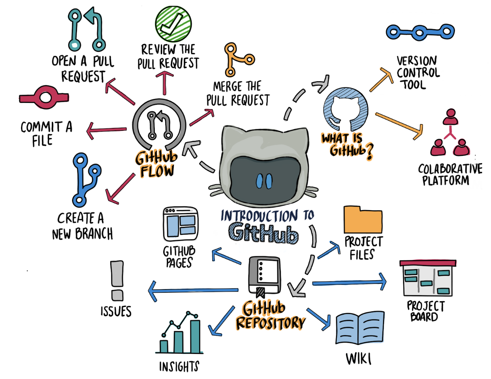

  

# Curso de Git/GitHub | SCESI

Este repositorio contiene el desarrollo de los temas vistos en el curso de Git y GitHub impartido en SCESI. Cada rama representa una lección específica.
El contenido fue trabajado a partir del material oficial del curso, y se complementó con investigaciones y recursos adicionales para profundizar en los conceptos clave.

  

## Contenido por ramas

| Rama                          | Tema                                |
|-------------------------------|--------------------------------------|
| 1-IntroduccionGit           | Introducción general a Git          |
| 2-EstadosArchGit            | Estados de un archivo en Git        |
| 3-HeadGit                   | Qué es y cómo funciona HEAD         |
| 4-RamasGit                  | Creación y gestión de ramas         |
| 5-Conflictos                | Resolución de conflictos            |
| 6-GitvsGithub               | Diferencias entre Git y GitHub      |
| 7-Push-Pull-PullRequest     | Trabajo con repositorios remotos    |
| 8-Flujos-de-Trabajo         | Flujos de trabajo con Git (GitFlow, GitHub Flow, etc.) |

## Rama principal (main)

Esta rama solo contiene la introducción general y el índice de contenidos. Usá el selector de ramas para explorar cada tema :)

---