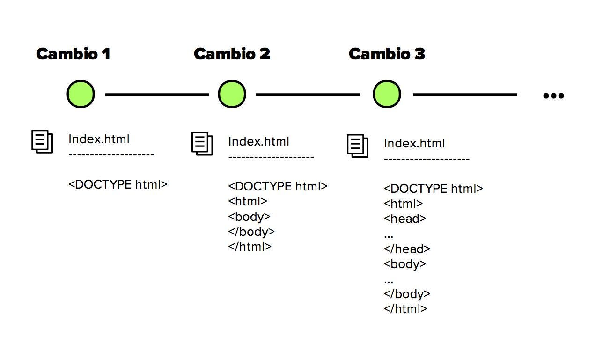
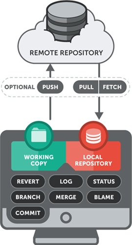

  

# Curso Git/GitHub | SCESI

Este repositorio documenta el contenido aprendido en el curso de control de versiones con Git y GitHub, impartido por SCESI. Cada clase se desarrolla en una rama independiente, con apuntes organizados, prácticas y comandos aplicados en diferentes ramas.

  

---

## Clase 1 – Introducción a Git

En la primera clase se abordó el concepto de control de versiones y la razón de por qué se ha vuelto una herramienta esencial en el desarrollo de software.

### ¿Qué es un sistema de control de versiones?

Es un sistema que permite registrar y organizar los cambios realizados en los archivos de un proyecto a lo largo del tiempo. Permite ver el historial de cambios, identificar quién hizo cada modificación y cuándo, así como volver atrás en caso de errores. Además, facilita el trabajo en equipo sin que los cambios de una persona interfieran con los de otra.

   
  <em>Figura: Representación visual del historial de versiones en Git, donde cada punto corresponde a un commit con cambios progresivos en un archivo.</em>

### Importancia de un control de versiones

- **Rendimiento:** Git guarda solo lo que cambia, no todo el archivo.
- **Seguridad:** Permite rastrear cada cambio y quién lo realizó.
- **Flexibilidad:** Posibilita trabajar en paralelo mediante ramas, sin seguir un flujo lineal.

### ¿Qué es Git?

Git es como una máquina del tiempo para tus archivos. Permite guardar cada cambio importante, volver a versiones anteriores y colaborar sin conflictos ni pérdida de información.

### ¿Qué es un repositorio?

En Git, un repositorio es el corazón del proyecto: contiene los archivos y todo su historial. Puede ser:

- **Local:** Almacenado en la máquina del usuario.
- **Remoto:** Alojado en plataformas como GitHub o GitLab para facilitar la colaboración.

Cuando usamos git init, convertimos una carpeta común en un repositorio local.

   
  <em>Figura: Relación entre repositorio local y remoto en Git.</em>

