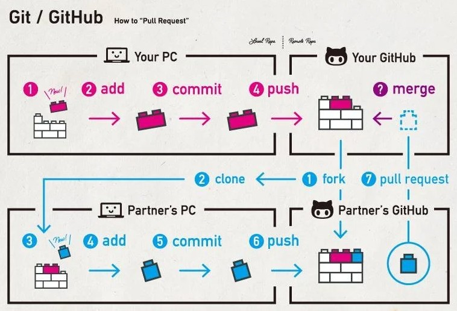

<p align="center">
  
</p>

# Git/GitHub | SCESI

---

## ¿Qué es git push?

Es un comando, git push se utiliza para enviar los commits locales al repositorio remoto (como GitHub).

```bash
git push origin nombre-de-la-rama
```

Esto sincroniza nuestro historial con el remoto, permitiendo que otros lo vean o lo integren.

**Variaciones:**

- **git push:** Empuja los cambios a la rama actual configurada por upstream.
- **git push -u origin nombre:** Empuja y define la rama de seguimiento.
- **git push -f:** Fuerza el push (es peligroso si se esta reescribiendo el historial).
- **git push --delete origin nombre:** Elimina una rama remota.

## ¿Qué es git pull?

Es un comando que descarga y fusiona los cambios del repositorio remoto con una rama actual.

```bash
git pull origin nombre-de-la-rama
```

Es equivalente a:

```bash
git fetch
git merge origin/nombre-de-la-rama
```

**Variaciones:**

- **git pull:** Fusión automática de la rama por defecto.
- **git pull --rebase:** Reescribe el historial sobre los cambios remotos.
- **git pull --all:** Descarga cambios de todos los remotos.

### ¿Pueden haber conflictos al hacer pull?

Si, si queremos modificar una parte de un archivo y otra persona también quiere hacerlo, Git no Git no sabrá qué versión mantener. Esto genera un conflicto que deberás resolver manualmente.

## Push vs Pull

| Comando | Descripción                               | Dirección      |
| ------- | ----------------------------------------- | -------------- |
| **push**  | Envía tus cambios al repositorio remoto   | Local → Remoto |
| **pull**  | Descarga los cambios remotos a tu entorno | Remoto → Local |

**¿Cuándo usar cada uno?**

- Usar **push** cuándo finalicemos una tarea y querramos compartirla.
- Usar **pull** para actualizarnos con lo último antes de empezar.

**Recomendación:**

- Siempre hacer un **git pull** antes de hacer un **git push**.
- Revisar y editar con cuidado los archivos marcados por Git si hay conflictos.

## ¿Qué es una Pull Request?

Una Pull Request (PR) es una solicitud para que los cambios realizados en una rama sean revisados e integrados en otra rama dentro de un repositorio remoto como GitHub.

Nos permiten integrar cambios con seguridad, claridad y revisión, no solo siendo cuestión de código, sino también de comunicación efectiva.

<p align="center">
  
  <br>
  <em>Figura: Visualización del proceso de colaboración mediante Fork(bifurcación), Push y Pull Request en GitHub.</em>
</p>

## ¿Cómo crear una Pull Request en GitHub?

Existen dos formas principales de hacerlo:

**1. Automáticamente, al subir una rama nueva**

Si hacemos un **git push** a una nueva rama del repositorio, GitHUb nos mostrará un botón para crear una **Pull Request** directamente desde la vista del repositorio, si hacemos:

```bash
git checkout -b nueva-funcionalidad
// hacemos cambios, commits y push
git push origin nueva-funcionalidad
```

Nos aparecerá un aviso:

**Compare & Pull Request** → hacemos clic y completamos el formulario.

**2. Manualmente desde la pestaña "Pull Requests"**

1. Vamos al repositorio de GitHub.
2. Hacemos clic en la pestaña **Pull Requests**.
3. Clic en **New Pull Request**.
4. Elegimos la **base branch** (ej: main) y la **compare branch** (nuestra rama).
5. Escribimos un título descriptivo y un comentario detallado.
6. Es opcional: Asignar revisores, etiquetas o proyectos.

## Buenas prácticas al crear una PR

- Hacer cambios específicos y enfocados, evita PRs muy grandes.
- Usar títulos claros, parecidos al commit.
- Describir lo que hicimos y por qué en el mensaje.
- Si es necesario podemos adjuntar capturas o videos cortos.
- Asegurarnos de que el código compile y pase pruebas básicas.

## Revisar una PR

1. Proporcionar siempre feedback positivo.
2. Concreción y claridad.
3. Entender el contexto. puede que a veces tengamos que poner parches a nuestro código y que, pase a no ser el más bonito per, si que cumpla su cometido.
