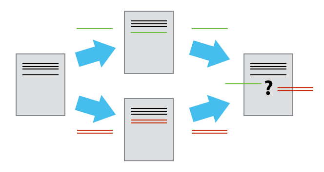
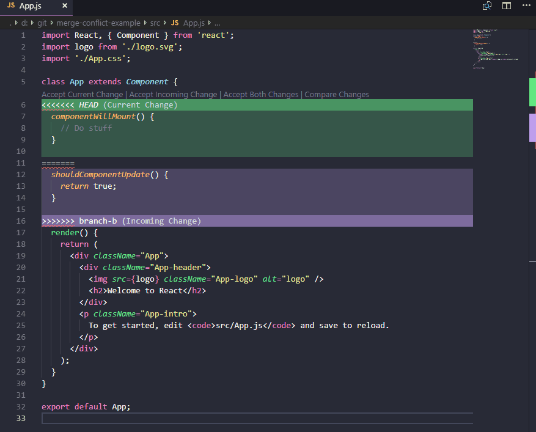

<p align="center">
  
</p>

# Git/GitHub | SCESI

## Conflictos
---

### ¿Qué es un conflicto en Git?

Un conflicto en Git ocurre cuando Git no puede combinar automáticamente los cambios de dos ramas porque hay modificaciones distintas en la misma línea de un archivo.
Esto suele pasar durante una fusión de ramas (merge) o un rebase, y necesita que una persona resuelva manualmente qué versión conservar.

<p align="center">
  
  <br>
  <em>Figura: Ilustración de un conflicto en Git, cuando dos ramas modifican la misma parte de un archivo y Git no puede resolverlo automáticamente.</em>
</p>

### ¿Por qué ocurre los conflictos al fusionar Ramas?

Un conflicto aparece cuando dos ramas han editado la misma sección del mismo archivo de manera diferente.
Git no puede decidir cuál de los dos cambios conservar, por eso interrumpe la operación y marca el archivo como en conflicto.

### Ejemplo de conflicto

Cuando se produce un conflicto, Git marca el archivo así:

```bash
<<<<<<< HEAD

código de la rama actual

=======

código proveniente de la rama fusionada

>>>>>>> feature
```

### Resolución de Conflictos

Para resolver el conflicto, debemos:

1. Abrir el archivo afectado
2. Elegir qué cambios conservar
3. Eliminar las marcas especiales
4. Guardar el archivo

*Opciones*

- **Mantener ls cambios de main (HEAD):** Conservar solo el bloque superior.
- **Mantener los cambios de feature:** Conservar solo el bloque inferior.
- **Fusionar manualmente:** Combinar ambos bloques y ajustarlos si es necesario.

<p align="center">
  
  <br>
  <em>Figura: VSCode muestra un conflicto de fusión al unir dos ramas con cambios en la misma sección de código. Permite al usuario aceptar uno u otro cambio, ambos o comparar.</em>
</p>
