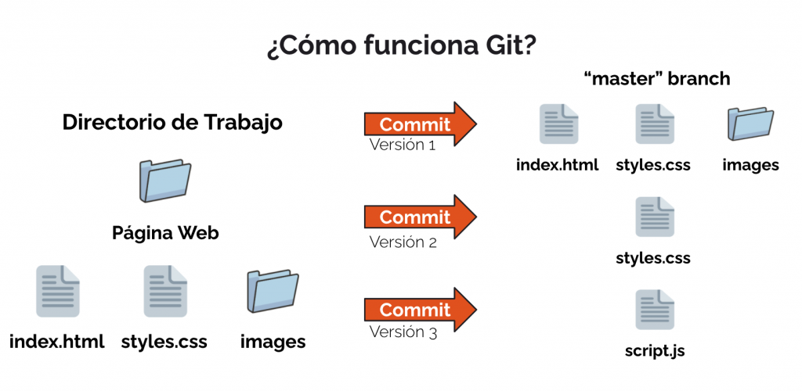

<p align="center">
  
</p>

# Git/GitHub | SCESI

## Taller de Git y GitHub

---

### ¿Git y GitHub son lo mismo?

No, aunque están relacionados, Git y GitHub son herramientas diferentes:

| Git                          | GitHub                                          |
|------------------------------|--------------------------------------------------|
| Sistema de control de versiones | Plataforma de alojamiento de repositorios Git   |
| Se instala localmente         | Se accede vía web                               |
| Funciona sin internet         | Requiere conexión para sincronización remota     |
| Controla versiones de archivos | Facilita colaboración, pull requests, issues    |
| Comandos en la terminal       | Interfaz visual e integración con proyectos     |


### ¿Qué es Git?

Git es un sistema de control de versiones distribuido que permite registrar cambios y trabajar en equipo sin sobrescribir el trabajo de otros.

Fue creado por Linus Torvalds en 2005 para el desarrollo del kernel de Linux.

<p align="center">
  
  <br>
  <em>Figura: Git guarda versiones del proyecto con cada commit, registrando los archivos modificados en cada punto del tiempo.</em>
</p>

### ¿Qué es GitHub?

GitHub es una plataforma en la nube que aloja repositorios Git. No reemplaza a Git, sino que lo complementa.

<p align="center">
  
  <br>
  <em>Figura: GitHub actúa como repositorio remoto desde el cual múltiples usuarios sincronizan sus repositorios locales.</em>
</p>

**Funcionalidades:**

- Repositorios remotos y backups.
- Pull requests y revisión de código.
- Issues, documentación y wikis.
- Control de acceso y automatización CI/CD.

*GitHub se encarga de la colaboración y el alojamiento.*

### ¿GitHub es la única opción?

No, también existen otras plataformas que alojan repositorios Git:

- **Gitlab** que tiene pipelines de CI/CD integrados.
- **Bitbucker** que es muy usado con Jira y otras herramientas de Atlassian.
- **SourceForge, Azure DevOps, AWS CodeCommit** y entre otros.

*Git es independiente de la plataforma, podemos subir el mismo proyecto a cualquiera de ellas.*

### ¿Qué es un repositorio remoto?

Es la versión online del repositorio local que tenemos en nuestra PC. Sirve para colaborar, compartir y respaldar el trabajo.

Podemos vincularlo a GitHub con:

```bash
git remote add origin https://github.com/usuario/repositorio.git
```

<p align="center">
  
  <br>
  <em>Figura: Representación de un repositorio remoto en Git y cómo interactúan los desarrolladores con él usando comandos como clone, push, pull y fetch.</em>
</p>

