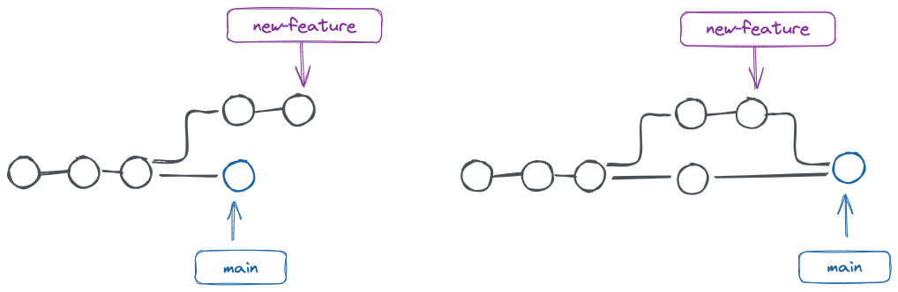
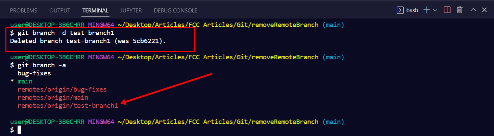

<p align="center">
  
</p>

# Git/GitHub | SCESI

## Ramas y Merge

---

### ¿Qué es una Rama?

Una rama en Git es un apuntador móvil que marca una serie de commits. Representa una línea de desarrollo independiente y permite realizar cambios sin afectar el proyecto principal.

Por defecto, todos los repositorios comienzan en la rama main, pero se pueden crear múltiples ramas para nuevas funcionalidades, pruebas o correcciones.

<p align="center">
  
  <br>
  <em>Figura: Representación de dos ramas creadas desde la rama principal.</em>
</p>

### ¿Para qué sirven las Ramas?

Las ramas son fundamentales para:

- Desarrollar nuevas funcionalidades sin modificar el código estable.
- Trabajar en equipo sin sobrescribir los cambios de otros.
- Realizar pruebas, correcciones y prototipos sin riesgo.
- Organizar mejor el flujo de trabajo y aislar tareas específicas.

Trabajar con ramas nos permite mantener un desarrollo no lineal, ordenado y fácilmenteble.

### Creación de una nueva Rama

Para crear una nueva rama, podemos usar:

```bash
git branch nombre-de-la-rama
```

Para crear y moverse directamente a ella:

```bash
git checkout -b nombre-de-la-rama
```

Después de trabajar en una rama y hacer los commits necesarios, se puede volver a la rama principal (main) y fusionar los cambios.

## Fusión de Ramas (merge)

### ¿Qué es una fusión de Ramas?

Una fusión de ramas, también conocido como merge, es el proceso mediante el cual se integran los cambios de una rama secundaria en otra rama principal. Esto permite consolidar el trabajo paralelo desarrollado de forma independiente.

El objetivo de un merge es mantener la coherencia del proyecto y unir el hirtorial de desarrollo de ambas ramas en un solo flujo.

<p align="center">
  
  <br>
  <em>Figura: Proceso de fusión de ramas. Se observa un merge no fast-forward con un commit de integración, además de ejemplos para editar o evitar el mensaje automático del commit durante el merge.</em>
</p>

### ¿Cómo se realiza un merge?

Para hacer un merge, primero se debe posicionar en la rama que recibirá los cambios (por lo general, main) y luego ejecutar el siguiente comando:

```bash
git checkout main
git merge nombre-de-la-rama
```

Si los cambios no entran en conflicto, Git realizará la fusión automaticamente y creará un commit de merge que une ambas historias.

### Posibles destinos de las ramas: fusión o abandono

Una vez que una rama cumplió su propósito, existen dos caminos posibles:

- **Fusión:** Si los cambios son necesarios, se deben integrar a main u otra rama principal mediante un merge.
- **Abandono:** Si los cambios no aportan valor, se puede eliminar la rama sin fusionarla.

### Merge No Fast-Forward

**¿Qué es un fast-forward?**

Un fast-forward merge ocurre cuando se fusionan ramas y los commits de la rama a fusionar están directamente delante de la rama actual. Git simplemente mueve el puntero de la rama actual hacia adelante, ya que no hay divergencia de código.

**¿Qué permite hacer?**

Permite hacer merges creando un commit para indicar la fusión. Usando el comando:

```bash
git merge <rama> --no-ff
```
<p align="center">
  
  <br>
  <em>Figura: Comparación entre merge fast-forward (izquierda) y no fast-forward (derecha).</em>
</p>

| Característica               | Merge Fast-forward                            | Merge No Fast-forward                            |
|-----------------------------|-----------------------------------------------|--------------------------------------------------|
| ¿Qué hace Git?            | Simplemente avanza el puntero de la rama. | Crea un commit de fusión (merge commit).     |
| ¿Hay divergencia de ramas?| No, solo una rama ha tenido cambios.          | Sí, ambas ramas tienen cambios.          |
| ¿Se crea historial nuevo? | No, los commits se ven lineales.              | Sí, se ve una bifurcación y unión.           |
| ¿Es más limpio?           | Sí, si no necesitas trazar múltiples ramas.   | Sí, preserva el contexto del merge. |
| ¿Cómo forzarlo?           | Se usa por defecto.                           | Usa git merge --no-ff para forzar uno.         |


## Eliminación de Ramas

### ¿Por qué eliminar Ramas?

Las ramas en Git son herramientas temporales que se crean para desarrollar nuevas funcionalidades, corregir errores o hacer pruebas sin afectar la rama principal (main),una vez que la rama ha cumplido su propósito y ha sido fusionada correctamente, mantenerla puede generarnos desorden.

Eliminar ramas que ya no se utilizan nos permite:

- Mantener el repositorio limpio y organizado.
- Evitar confusión entre ramas activas y ramas obsoletas.
- Reducir el riesgo de errores por trabajar en ramas desactualizadas.

En proyectos colaborativos, es una práctica recomendada para no saturar el historial visual con ramas que ya no tienen utilidad.

<p align="center">
  
  <br>
  <em>Figura: Eliminación de una rama local con <code>git branch -d</code>. Aunque la rama local desaparece, sigue existiendo en el repositorio remoto hasta que se elimine manualmente desde allí.</em>
</p>

## Buenas prácticas al trabajar con Ramas

- **Eliminar ramas locales después del merge:** Si una rama ya fue fusionada a main, eliminamos para evitar mantener versiones duplicadas del mismo trabajo.
- **No eliminar ramas activas o sin fusionar sin respaldo:** Para evitar esto revisemos el historial antes de borrar.
- **Usar nombres descriptivos para facilitar su identificación y limpieza posterior**
- **Eliminar también las ramas remotas si ya no se usarán**, para evitar confusión al clonarlo o trabajar en equipo.

## Comandos para eliminar Ramas locales

Eliminar una rama local que ya fue fusionada:

```bash
git branch -d nombre-de-la-rama
```

Eliminar una rama local forzadamente sin importar si ya fue fusionada:

```bash
git branch -D nombre-de-la-rama
```


