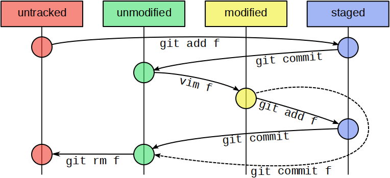

  

# Git/GitHub | SCESI

## States y Commits

---

## Estados de los archivos en Git

Git clasifica los archivos en tres posibles estados:

- **Modified (Modificado):** El archivo fue cambiado respecto a su último estado guardado, pero Git aún no lo considera listo para registrar.
- **Staged (Preparado):** El archivo ha sido marcado con git add, indicando que está listo para ser incluido en el próximo commit.
- **Commited (Confirmado):** El archivo fue registrado en el repositorio mediante un commit. Este estado representa una versión segura y parte del historial del proyecto.

Flujo: **Modificación → Preparado → Confirmado**

  
   
  <em>Figura: Diagrama de los estados de un archivo en Git: untracked, unmodified, modified y staged.</em>

### ¿Qué es un commit?

Un commit es un registro permanente de los cambios realizados en los archivos preparados. Puede entenderse como una fotografía del proyecto en un momento específico.

Cada commit incluye:

- Un identificador único
- El autor del camnbio
- La fecha y hora
- Un mensaje descrptivo
- Los archivos afectados

  
   
  <em>Figura: Tres formas comunes de realizar un commit en Git. Fuente: EDteam.</em>

### Buenas prácticas al hacer commits

- Hacer commits frecuentemente para mantener el progreso guardado.
- Escribir mensajes descriptivos, breves y claros.
- Evitar mensajes genéricos como: "prueba", "cosas varias", "update"
- Usar verbos en infinitivo o presente: "Corregir validación del formulario", "Actualizar README"

### Comparación entre buenos y malos mensajes de commit

<table>
  <tr>
    <td align="center">
       
      <em>Ejemplo de un buen mensaje de commit</em>
    </td>
    <td align="center">
       
      <em>Ejemplos de malos mensajes de commit</em>
    </td>
  </tr>
</table>

