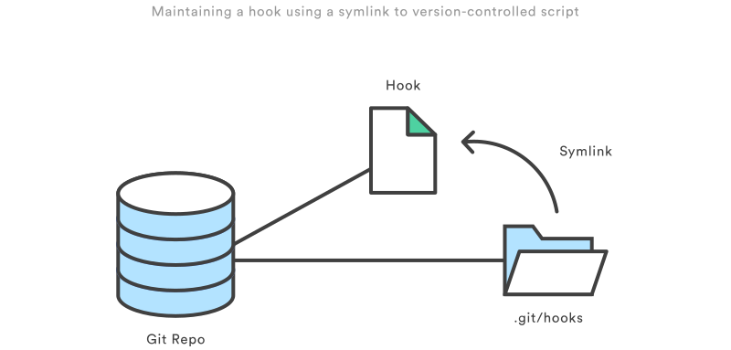

<p align="center">
  
</p>

# Curso de Git/GitHub | SCESI

## Hooks, Alias y Trucos en Git

<p align="center">
  
</p>

---

## ¿Qué es un Hook?

En Git, los hooks son como trucos que se activan automáticamente cuando hacemos cosas como crear commits, subir cambios o juntar ramas de código.

<p align="center">
  
</p>

## Hooks del lado del cliente

Solo afectan al repositorio local.

Ejemplos:

- **pre-commit**: Ejecuta un script antes de hacer un commit, es ideal para correr linters o prevenir commits de archivos innecesarios.
- **commit-msg**: Permite validar o modificar automáticamente el mensaje del commit.
- **prepare-commit-msg**: Agrega información adicional al mensaje de commit.
- **post-commit**: Ejecuta acciones después de un commit, como enviar notificaciones.
- **pre-push**: Ejecuta pruebas automáticas antes de permitir un push.
- **post-checkout** y **post-merge**: Limpian ramas o directorios luego de un checkout o merge.

## Creando mi primer Hook

Para crear un hook necesitamos:

1. Crear un archivo en la carpeta `.git/hooks/` con el nombre del hook.
2. Escribir el script que quieras ejecutar.
3. Asegurarnos de darle permisos de ejecución (`chmod +x nombre-del-hook`).

Podemos usar lenguajes como bash, node.js, python, perl, etc.

## ¿Qué es un Alias en Git?

Un alias en Git nos permite definir comandos abreviados.

Por ejemplo:

```bash
git config --global alias.st status
git config --global alias.cm commit
git config --global alias.br branch
```
De esta manera podemos usar git st en lugar de git status, o git cm en lugar de git commit.

<p align="center">
  
</p>

<p align="center"><em>Figura: Ejemplos de alias personalizados configurados en Git Bash para Windows.</em></p>

## Trucos útiles en Git

### Guardar cambios temporalmente

```bash
git stash
```

Guarda cambios no confirmados.

```bash
git stash -u
```

Guarda cambios incluyendo archivos no rastreados (untracked).

```bash
git stash pop
```

Restaura los cambios guardados con stash.

### Aplicar cambios de un commit específico

```bash
git cherry-pick <SHA>
```
Aplica un commit específico a tu rama actual.

### Detectar el commit que introdujo un bug

Usando git bisect:

```bash
git bisect start
git bisect bad
git bisect good
git bisect reset
```

Nos permite encontrar el commit problemático mediante búsqueda binaria.

### Cambiar el mensaje del último commit

```bash
git commit --amend -m "Nuevo mensaje de commit"
```

Nos permite modificar el mensaje del último commit realizado.
Es ideal para corregir errores de redacción o aclarar mejor la descripción.

### Recuperar un archivo específico de otra rama o commit

```bash
git checkout <SHA> -- nombre-del-archivo
```

Nos permite restaura un archivo individual desde un commit anterior o desde otra rama, sin afectar el resto del proyecto.
