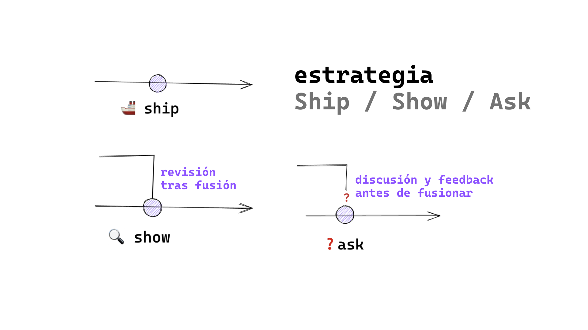

  

# Git/GitHub | SCESI

## Flujos de trabajo
---

## ¿Qué es Git Flow?

Es el flujo de trabajo más antiguo ideado para facilitar el trabajo colaborativo en proyectos, se caracteriza por su estructura de ramas con funciones específicas.
Este modelo nos permite trabajar con múltiples desarrolladores sin conflictos, nos proporciona claridad en el estado del proyecto, facilita el control de versiones y el seguimiento de los cambios.

### **Ramas en GitFlow**

1. **main o master:** Contiene el código de producción.
2. **develop:** Contiene código de pre-producción que todavía tiene que ser probado y validado (rama de integración de funcionalidades).
3. **feature:** Se utiliza para desarrollar nuevas funcionalidades o características nuevas para el proyecto.
4. **release:** Se usa para preparar el lanzamiento final y corregir errores menores antes del despliegue.
5. **hotfix:** Rama usada para parches o arreglos de bugs pequeños.

  
   
  <em>Figura: Diagrama del modelo GitFlow. Se muestra la relación entre las ramas master, develop, feature, release y hotfix.</em>

## ¿Qué es GitHub Flow?

Es un flujo de trabajo (modelo) más simple, consiste en usar únicamente la rama *main* y ramas efímeras para cada funcionalidad, todo cambio se realiza mediante Pull Requests.

  
   
  <em>Figura: GitHub Flow. El proceso parte de la rama principal, creando una rama de trabajo donde se hacen cambios, se crea una Pull Request, se prueba el código y se fusiona tras recibir retroalimentación.</em>

## Trunk Based Development

Este modelo se centra en el trabajo directo sobre la rama pincipal (main) y las ramas auxiliares efímeras que quiera ser integrada por medio de una Pull Request.
Es útil si contamos con un buen sistema CI/CD.

  
   
  <em>Figura: Trunk Based Development. Los desarrolladores trabajan en ramas de corta duración que se integran frecuentemente al tronco principal.</em>

## Ship / Show / Ask

Este modelo se basa en la confianza y responsabilidad del equipo, es especialmente útil en sistemas con CI/CD.

- **Ship:** Se abre en la rama principal sin revisión.
- **Show:** Abre una petición de cambios para que sean revisados por CI pero se fusiona inmediatamente.
- **Ask:** Abre una Pull Request para discutir los cambios antes de fusionarlos.

  
   
  <em>Figura: Estrategia Ship / Show / Ask. Se ilustra el flujo de cada modalidad: Ship (merge directo), Show (revisión posterior) y Ask (discusión previa).</em>

## Reglas de Ship / Show / Ask

1. Tenemos un buen sistema CI/CD, que hace que la rama principal siempre sea desplegable y que evite que lleguen errores no deseados a producción.
2. Confiamos en el equipo y existen buenas prácticas de desarrollo.
3. Las revisiones de código no son requerimientos.
4. Las ramas son lo más pequeñas posibles, tienen un tiempo de vida corto y siempre salen directamente desde la rama principal.
5. El equipo ha sabido lidiar con su ego individual, el equipo confía entre ellos y las pruebas automáticas se ejecutan correctamente.

## Comparación de modelos

| Modelo            | Ramas principales      | Uso ideal                                      | CI/CD       | Revisión de código        |
|-------------------|------------------------|------------------------------------------------|-------------|---------------------------|
| GitFlow           | main, develop, etc.    | Proyectos grandes, lanzamientos regulares      | Opcional    | Formal y estructurada     |
| GitHub Flow       | main + ramas efímeras  | Proyectos colaborativos con cambios frecuentes | Recomendado | Pull Requests             |
| Trunk Based       | solo main (+ efímeras) | Desarrollo rápido, DevOps                      | Requiere    | Opcional (automática)     |
| Ship/Show/Ask     | main + ramas pequeñas  | Equipos maduros con confianza y CI/CD          | Obligatorio | Variable según tipo        

*No hay un único modelo correcto, sino el más apropiado para cada contexto.*
